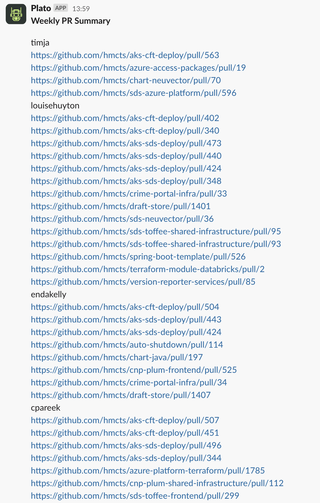

# dtspo-weekly-prs
Weekly Renovate PR check for DTS Platform Operations teams (currently only Blue squad)

- GitHub actions pipeline, runs at 14:00 every Monday.
- Uses platops-{colour} team name in GitHub to determine dynamic list of squad members.
- Offered to all PlatOps sqauds, pending opt-in feedback.

# Example

